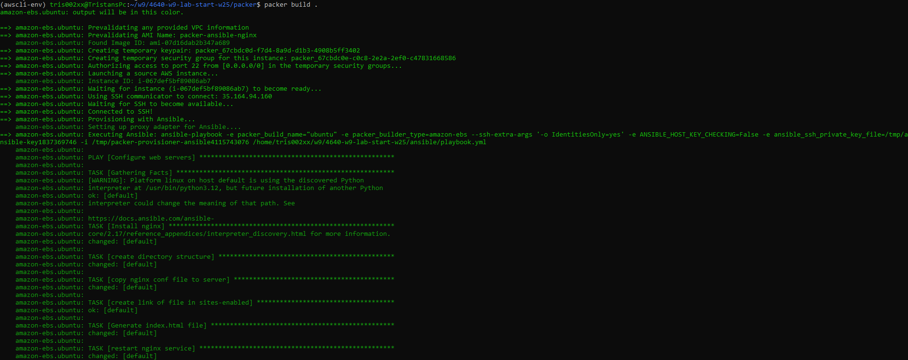
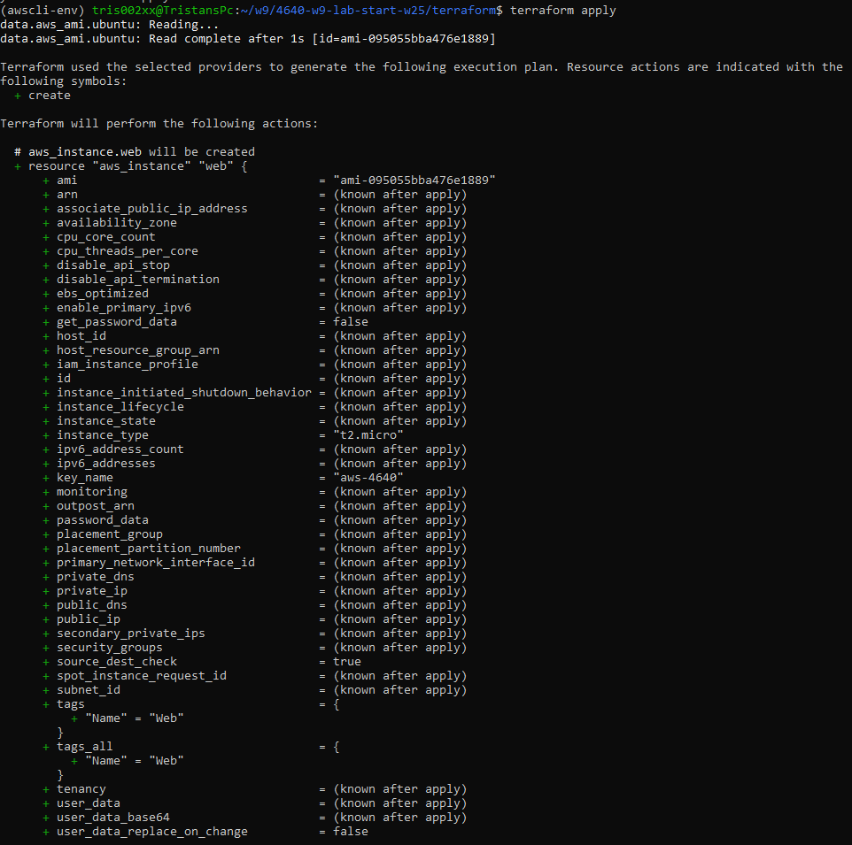

# 4640-w9-lab-start-w25

# Tristan Torres A01331949

## Creating ssh key pair for AWS
- Command for creating ssh key pair with ed25519 algorithm
``` ssh-keygen -t ed25519 -f ~/.ssh/wk_9```
- Using the provided ```import_lab_key``` to give ssh into aws
``` import_lab_key ~/.ssh/wk_9.pub ```

## Packer 
#### Documentation Used:
- [Building an AMI](https://developer.hashicorp.com/packer/tutorials/aws-get-started/aws-get-started-build-image)
- [Using Ansible Provisioner](https://developer.hashicorp.com/packer/integrations/hashicorp/ansible/latest/components/provisioner/ansible)
- [Using Varuables](https://developer.hashicorp.com/packer/guides/hcl/variables)
- [SSH Communicator](https://developer.hashicorp.com/packer/docs/communicators/ssh)

#### How to run
- Change your working directory: ```cd packer```
- Ensure packer template has no syntax error: ```packer validate .```
- Reformat packer template to follow canonical: ```packer fmt . ```
- Create AMI using packer template: ```packer build .```




## Terraform 
#### Documentation Used:
- [Using an existing AMI](https://registry.terraform.io/providers/hashicorp/aws/latest/docs/data-sources/ami)

#### How to run
- Change your working directory: ```cd terraform```
- Ensure ```main.tf``` has no syntax error: ```terraform validate```
- Reformat terraform to follow canonicalL ```terraform fmt```
- Verify terraform builds without executing: ```terraform plan```
- Provision IT infrastructure: ```terraform apply```


 